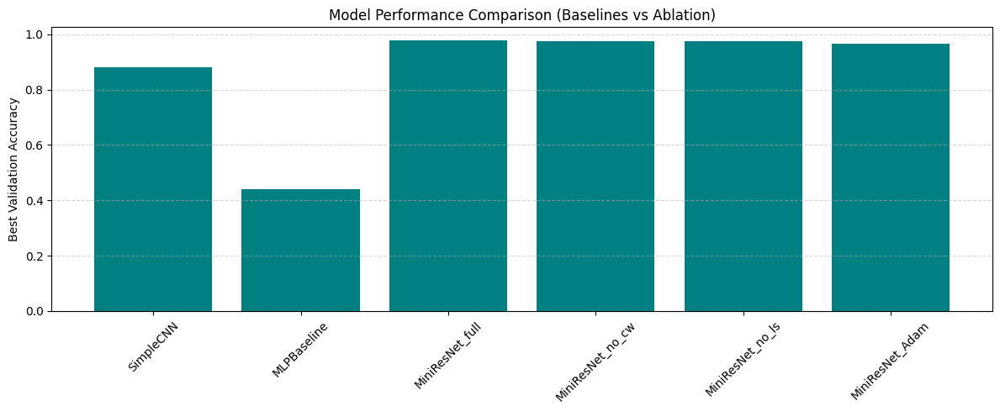
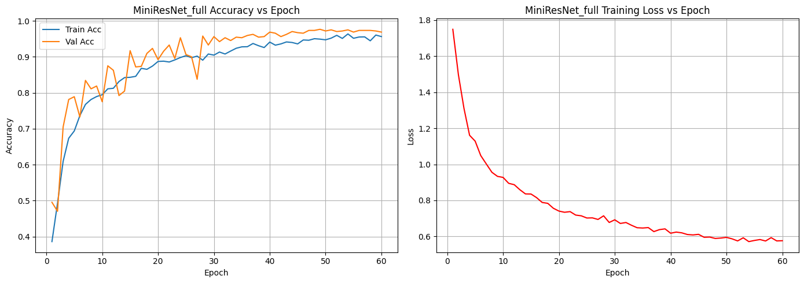
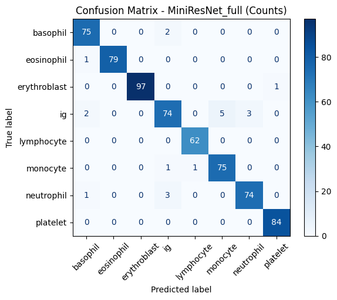
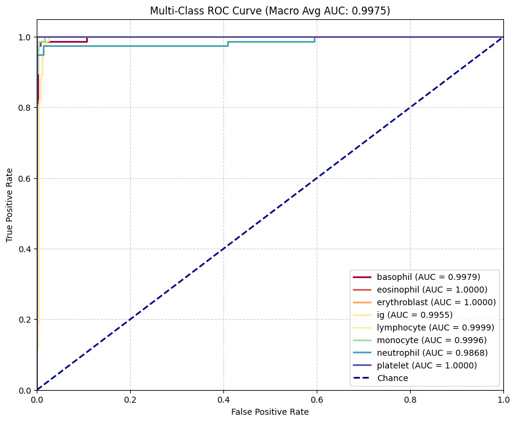
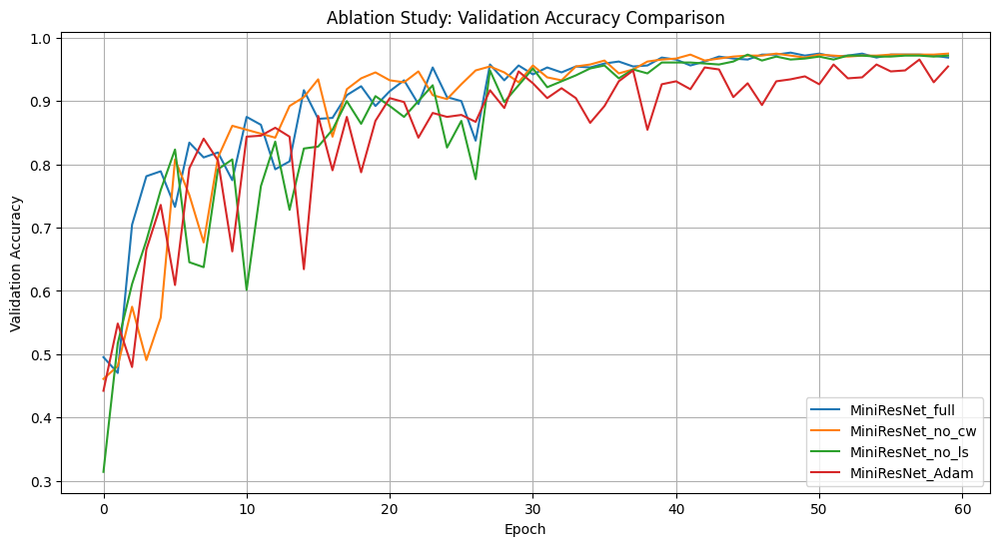

# 🩸 Blood Cell Classification with MiniResNet

> A lightweight residual deep learning model for eight-class blood cell image classification, developed entirely from scratch using PyTorch and evaluated through baseline comparisons, controlled ablation studies, and comprehensive validation metrics.



---

## Overview

Automated blood cell classification is an important application of deep learning in medical image analysis, assisting clinicians by providing fast and consistent identification of different blood cell types. This project presents **MiniResNet**, a lightweight residual convolutional neural network designed specifically for eight-class blood cell classification without using transfer learning or pre-trained models.

The study compares the proposed architecture against both a conventional CNN and a multilayer perceptron (MLP), followed by controlled ablation experiments to evaluate the contribution of class weighting, label smoothing, and optimizer selection. The final model achieved **97.66% validation accuracy** with a **macro ROC-AUC of 0.9975**, demonstrating that compact residual architectures can achieve excellent performance while remaining computationally efficient.

---

## Methodology

The original dataset contains **4,200 microscopy images**, including **3,200 labelled training images** and **1,000 unlabelled test images** across eight blood cell categories.

Before training, every image was inspected for corruption and blur, resized to **224×224**, normalised using dataset statistics, and augmented using geometric and photometric transformations. The training pipeline incorporated inverse-frequency class weighting, label smoothing, cosine learning-rate scheduling, and AdamW optimisation.

To evaluate the effectiveness of the proposed architecture, three experimental groups were investigated:

- **Baseline models:** MLP and SimpleCNN
- **Proposed model:** MiniResNet
- **Ablation models:** without class weighting, without label smoothing, and Adam instead of AdamW

---

## Results

| Model | Validation Accuracy |
|-------------------------------|:----------------:|
| MLP Baseline | 43.91% |
| SimpleCNN | 88.12% |
| MiniResNet (Full) | **97.66%** |
| MiniResNet (No Class Weighting) | 97.50% |
| MiniResNet (No Label Smoothing) | 97.34% |
| MiniResNet (Adam) | 96.56% |

The proposed MiniResNet consistently outperformed both baseline architectures while maintaining excellent stability across all ablation experiments. Removing class weighting, label smoothing, or AdamW each produced a measurable reduction in validation performance, demonstrating that every component contributed to the final model.

---

## Model Performance

### Training Behaviour



Training remained stable throughout 60 epochs, with validation accuracy converging close to **98%** while the training loss decreased smoothly without signs of severe overfitting.

### Confusion Matrix



The confusion matrix shows strong class-wise discrimination across all eight blood cell categories. Most prediction errors occur between morphologically similar cell types, particularly immature granulocytes and neighbouring white blood cell classes.

### Multi-Class ROC Analysis



The model achieved a **macro ROC-AUC of 0.9975**, with every class producing an AUC close to 1.0, indicating excellent separability and highly reliable classification performance.

### Ablation Study



Controlled ablation experiments quantified the contribution of each training component. The complete MiniResNet configuration consistently achieved the highest validation accuracy, confirming the combined benefit of residual learning, class weighting, label smoothing, and AdamW optimisation.

---

## Repository Structure

```text
blood-cell-miniresnet-classification/
│
├── notebooks/
│   └── blood-cell-miniresnet-classification.ipynb
│
├── reports/
│   └── blood-cell-miniresnet-academic-report.pdf
│
├── figures/
│
├── results/
│
├── data/
│
└── README.md
```

---

## Reproducing the Project

The original dataset is not included in this repository due to distribution restrictions.

To reproduce the experiments:

1. Obtain the authorised dataset.
2. Configure the dataset directory.
3. Install the required Python dependencies.
4. Run:

```bash
jupyter notebook notebooks/blood-cell-miniresnet-classification.ipynb
```

Because trained model checkpoints are not included, reproducing the reported performance requires retraining the model.

---

## Acknowledgement

This repository is a professionally organised version of a university coursework project. The experimental methodology, implementation, and reported results remain unchanged, while the repository structure, documentation, and presentation have been redesigned for portfolio purposes.
