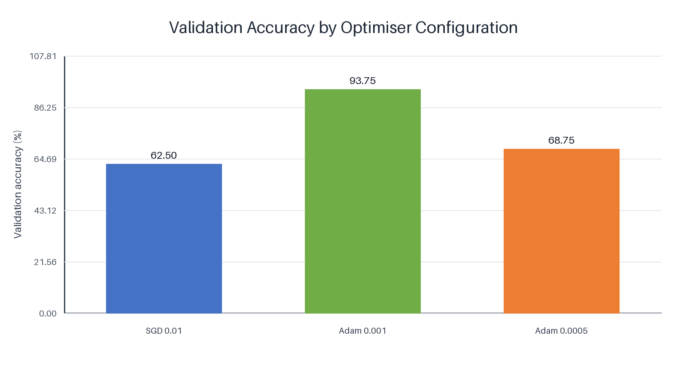
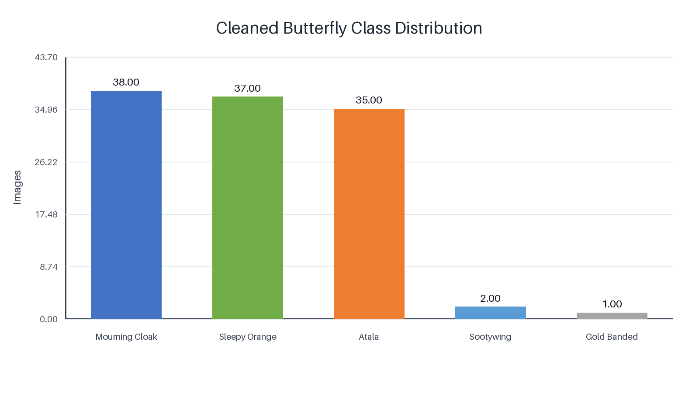
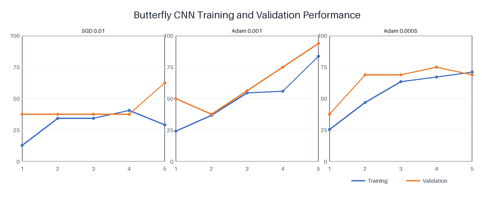

# 🦋 Butterfly Image Classification using Convolutional Neural Networks

> A PyTorch-based deep learning project investigating how different optimisation strategies influence butterfly image classification on a small and highly imbalanced dataset through controlled experimental comparison.



---

## Overview

Image classification is one of the most widely studied applications of deep learning, yet training reliable models becomes significantly more challenging when only a limited number of labelled images are available. This project investigates that challenge by developing a convolutional neural network (CNN) capable of classifying butterfly images into five species while examining how different optimisation strategies influence model convergence and classification performance.

Rather than proposing a complex architecture, the study focuses on understanding how optimiser selection affects training behaviour under identical experimental conditions. Three optimisation configurations were evaluated using the same CNN architecture, allowing differences in learning performance to be attributed solely to the optimisation strategy.

The best-performing configuration achieved **93.75% validation accuracy** and **72.22% internal test accuracy**, demonstrating that optimiser selection can substantially influence deep learning performance even when the network architecture remains unchanged.

---

## Methodology

The original butterfly dataset was supplied for academic coursework and is therefore not redistributed within this repository. Before model development, the dataset was carefully inspected to identify unreadable images, invalid annotations, and duplicate records. Following the cleaning process, **113 labelled images** remained across five butterfly species.

Each image was resized to **64 × 64 pixels**, normalised, and prepared for training using a consistent preprocessing pipeline. A custom convolutional neural network was implemented entirely in **PyTorch** and trained under three optimiser configurations:

- SGD (Learning Rate = 0.01)
- Adam (Learning Rate = 0.001)
- Adam (Learning Rate = 0.0005)

Keeping every other training parameter unchanged ensured that optimiser selection remained the only experimental variable.

---

## Dataset Distribution



The cleaned dataset contains **113 butterfly images** distributed across five species. Although three classes contain approximately thirty-five images each, the remaining two classes contain only **two** and **one** images respectively. This severe class imbalance presents a challenging classification problem and provides a practical demonstration of deep learning under limited-data conditions.

---

## Results

| Optimiser | Validation Accuracy |
|----------------|:----------------:|
| SGD (0.01) | 62.50% |
| Adam (0.0005) | 68.75% |
| **Adam (0.001)** | **93.75%** |

Among the three optimisation strategies, **Adam with a learning rate of 0.001** consistently produced the strongest validation performance. The results demonstrate that appropriate optimiser selection can dramatically improve convergence and classification accuracy without modifying the underlying network architecture.

---

## Model Performance

### Training Behaviour



Training and validation curves reveal distinct optimisation behaviour across the three experiments. The SGD configuration converged slowly and achieved the lowest validation accuracy, while Adam with a learning rate of 0.0005 demonstrated improved stability but reached an earlier performance plateau.

In contrast, Adam with a learning rate of **0.001** converged more rapidly and consistently achieved the highest validation accuracy throughout training, indicating superior optimisation efficiency for this dataset.

### Optimiser Comparison


A direct comparison of validation accuracy clearly highlights the impact of optimiser selection. Despite using the same CNN architecture and identical training data, the choice of optimiser produced substantial differences in classification performance, with Adam (0.001) outperforming the remaining configurations by a considerable margin.

---

## Repository Structure

```text
butterfly-cnn-classification/
│
├── notebooks/
│   └── butterfly-cnn-classification.ipynb
│
├── figures/
│   ├── class-distribution.png
│   ├── experiment-comparison.png
│   └── training-validation-performance.png
│
├── results/
│
├── data/
│
└── README.md
```

---

## Reproducing the Project

The original butterfly images are excluded from this repository because redistribution permission has not been confirmed.

To reproduce the experiments:

1. Obtain the authorised dataset.
2. Configure the dataset directory.
3. Install the required Python dependencies.
4. Run:

```bash
jupyter notebook notebooks/butterfly-cnn-classification.ipynb
```

The notebook reproduces the complete preprocessing, model training, optimiser comparison, and evaluation workflow.

---

## Acknowledgement

This repository is a professionally organised version of an original university coursework project. While the experimental methodology, implementation, and reported results remain unchanged, the repository structure, documentation, and presentation have been redesigned to improve reproducibility and portfolio presentation.