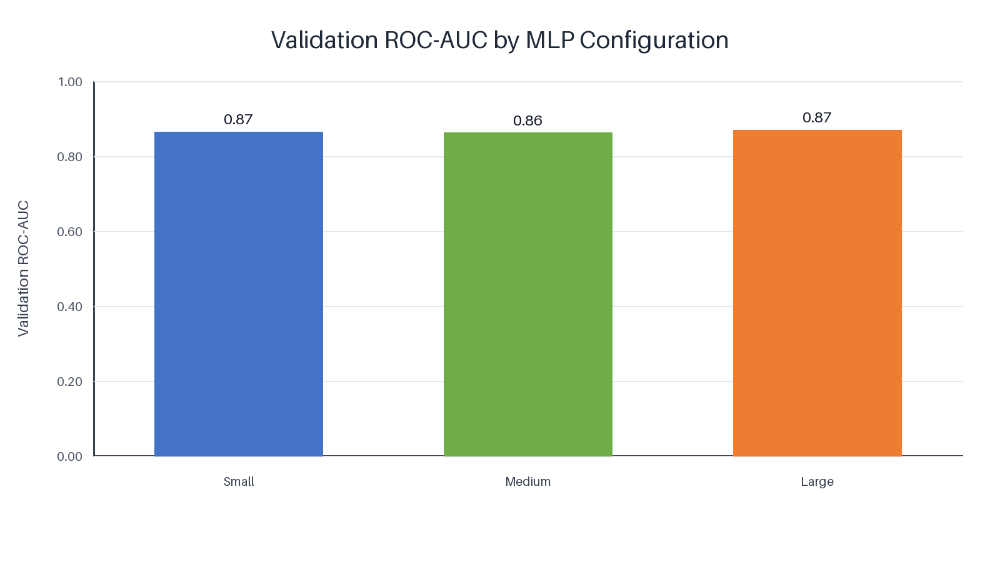
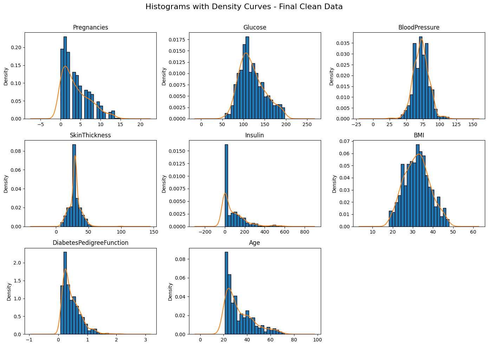
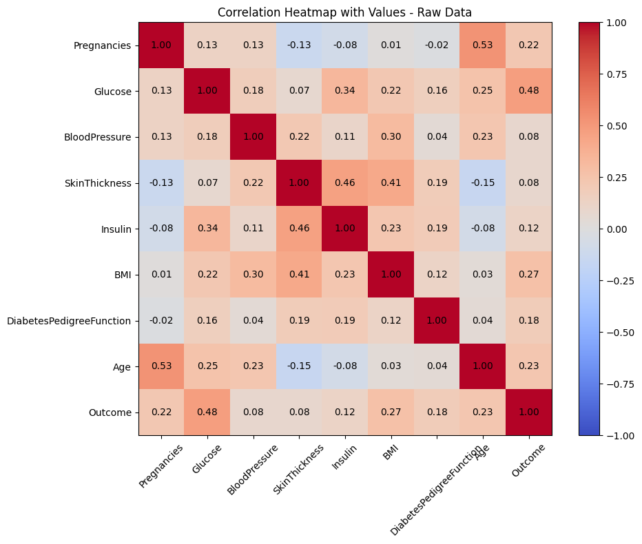
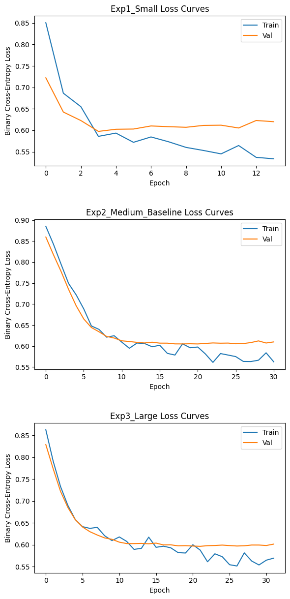
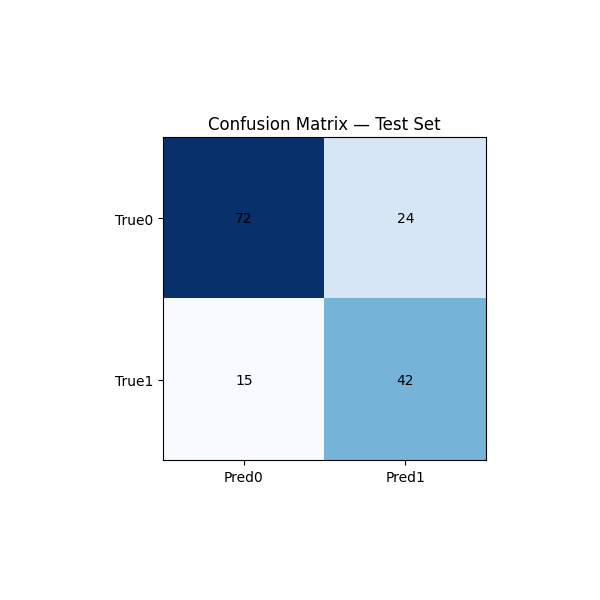

# 🩺 Diabetes Prediction using Multi-Layer Perceptron (MLP)

> An end-to-end deep learning study that develops, evaluates, and compares multiple multilayer perceptron architectures for diabetes prediction, demonstrating how data preprocessing, model design, and evaluation strategy influence clinical classification performance.



---

## Overview

Early identification of diabetes is essential for reducing long-term health complications through timely intervention and treatment. Machine learning provides an opportunity to assist clinical decision-making by learning complex relationships between routinely collected patient measurements and disease outcomes.

This project develops a **Multi-Layer Perceptron (MLP)** classifier using **PyTorch** to predict whether a patient is likely to have diabetes based on eight clinical measurements. Rather than evaluating a single neural network, the project investigates how changes in network capacity, learning rate, and dropout influence predictive performance.

Three different MLP architectures were developed and compared under identical experimental conditions before selecting the most clinically appropriate model using **Receiver Operating Characteristic Area Under the Curve (ROC-AUC)** rather than accuracy alone. The selected model was then evaluated on an unseen test dataset to assess its ability to generalise beyond the training data.

The study demonstrates that careful preprocessing, appropriate evaluation metrics, and systematic experimentation are as important as neural network architecture itself when developing reliable predictive models for healthcare applications.

---

## Dataset and Data Preparation

The project uses the **Pima Indians Diabetes Dataset**, originally collected by the National Institute of Diabetes and Digestive and Kidney Diseases, containing clinical measurements commonly associated with diabetes risk. The prediction task is binary classification, where the model determines whether a patient is diabetic or non-diabetic based on eight diagnostic features. :contentReference[oaicite:1]{index=1}

Before model development, the dataset underwent extensive preprocessing to improve data quality and reduce bias introduced by clinically impossible values.

Several variables contained zero values that are physiologically impossible, particularly Blood Pressure, Skin Thickness and BMI. Rather than removing a large proportion of observations, zero values were carefully replaced using appropriate statistical imputation while preserving the overall dataset size. Outlier treatment was then applied only to the strongest predictors identified through exploratory analysis, followed by feature standardisation and stratified data splitting to maintain class balance during training. :contentReference[oaicite:2]{index=2}

### Feature Distributions



The cleaned dataset exhibits substantially improved feature distributions while preserving clinically meaningful variation across the patient population.

### Feature Correlation



Exploratory analysis revealed that **Glucose** showed the strongest relationship with diabetes outcome, followed by **BMI**, supporting their importance during subsequent predictive modelling.

---

## Model Development

A fully connected neural network was implemented entirely in **PyTorch** using Rectified Linear Unit (ReLU) activation, dropout regularisation and the Adam optimiser.

Instead of searching for a single optimal architecture through trial and error, three controlled experiments were designed to evaluate the influence of network complexity and optimisation strategy:

| Experiment | Hidden Layers | Learning Rate | Dropout |
|------------|--------------|--------------:|---------:|
| Small | 32 → 16 | 0.01 | 0.20 |
| Medium (Baseline) | 64 → 32 | 0.001 | 0.20 |
| Large | 128 → 64 | 0.0005 | 0.30 |

All experiments were trained using weighted binary cross-entropy loss, mini-batch learning, early stopping and identical preprocessing, ensuring that observed performance differences resulted primarily from architectural choices.

---

## Validation Performance



Training behaviour remained stable across all three experiments with no evidence of severe overfitting. Increasing network capacity produced smoother convergence while dropout and early stopping effectively controlled model complexity.

Although the three architectures achieved similar overall predictive performance, the larger network consistently demonstrated superior discrimination capability when evaluated using ROC-AUC.

### Validation ROC-AUC Comparison


Among the three candidate models, the **Large MLP** achieved the highest validation ROC-AUC (**0.8704**), making it the preferred architecture for clinical prediction despite not achieving the highest validation accuracy. This highlights an important principle in medical machine learning: discrimination capability is often more valuable than raw accuracy when identifying high-risk patients. :contentReference[oaicite:3]{index=3}

---

## Final Test Evaluation

After selecting the Large MLP, the model was evaluated on a completely unseen test dataset.

| Metric | Score |
|--------|------:|
| Accuracy | **74.51%** |
| Precision | **63.64%** |
| Recall | **73.68%** |
| F1-score | **68.29%** |
| ROC-AUC | **0.8480** |

The final model maintained strong predictive performance on unseen data, demonstrating good generalisation while preserving high discrimination capability.

### Confusion Matrix



The confusion matrix illustrates balanced classification performance with strong detection of diabetic patients while maintaining an acceptable false-positive rate, making the model suitable for screening-oriented prediction tasks.

---

## Repository Structure

```text
diabetes-mlp-classification/
│
├── notebooks/
│   └── diabetes-mlp-classification.ipynb
│
├── reports/
│   └── diabetes-mlp-academic-report.pdf
│
├── figures/
│
├── results/
│
├── data/
│
└── README.md
```

---

## Reproducing the Project

The original dataset is not distributed within this repository.

To reproduce the experiments:

1. Obtain the authorised dataset.
2. Configure the dataset directory.
3. Install the required Python dependencies.
4. Execute the notebook:

```bash
jupyter notebook notebooks/diabetes-mlp-classification.ipynb
```

The notebook reproduces the complete workflow, including preprocessing, exploratory analysis, model training, validation experiments, and final test evaluation.

---

## Acknowledgement

This repository is a professionally organised version of an original university coursework project. The experimental methodology, implementation, and reported findings remain unchanged, while the repository structure, documentation, and presentation have been redesigned to improve clarity, reproducibility, and portfolio presentation.