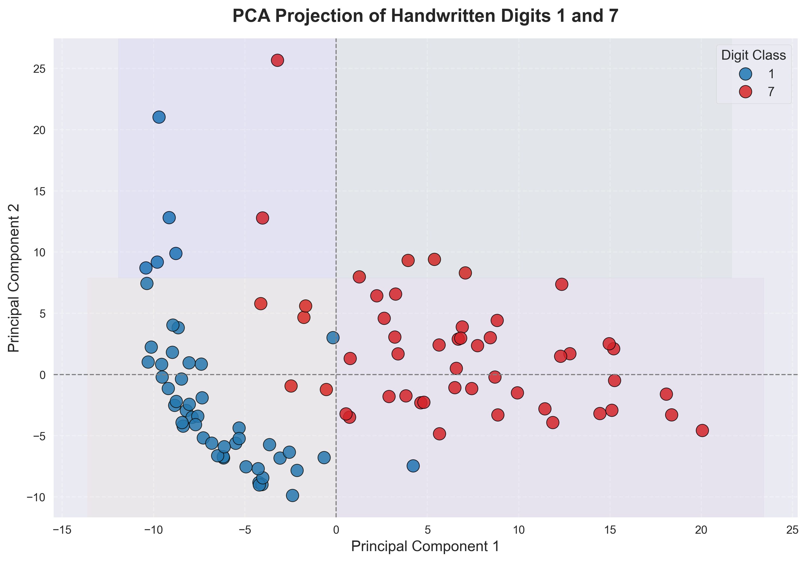
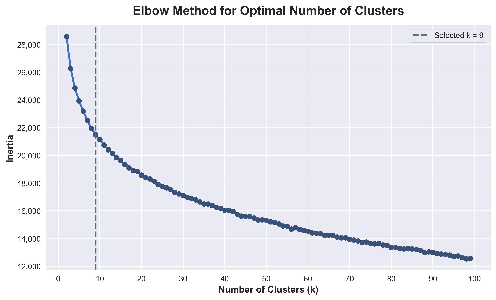
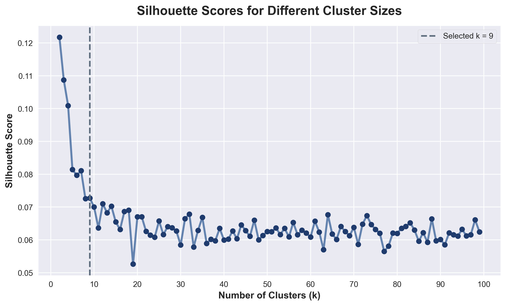
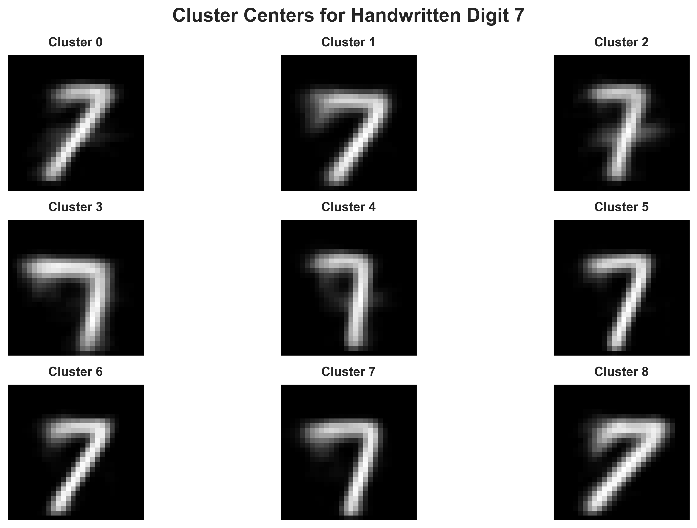
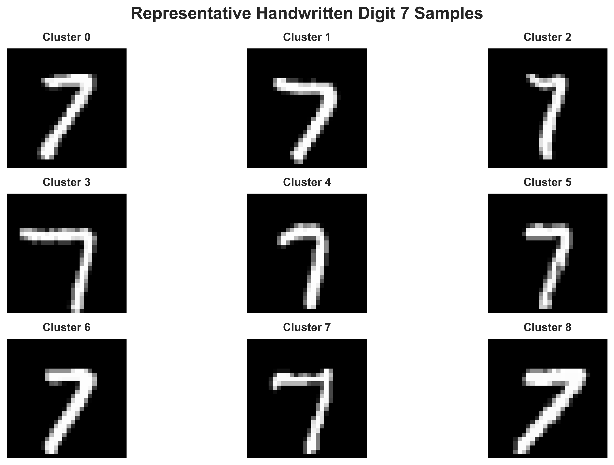
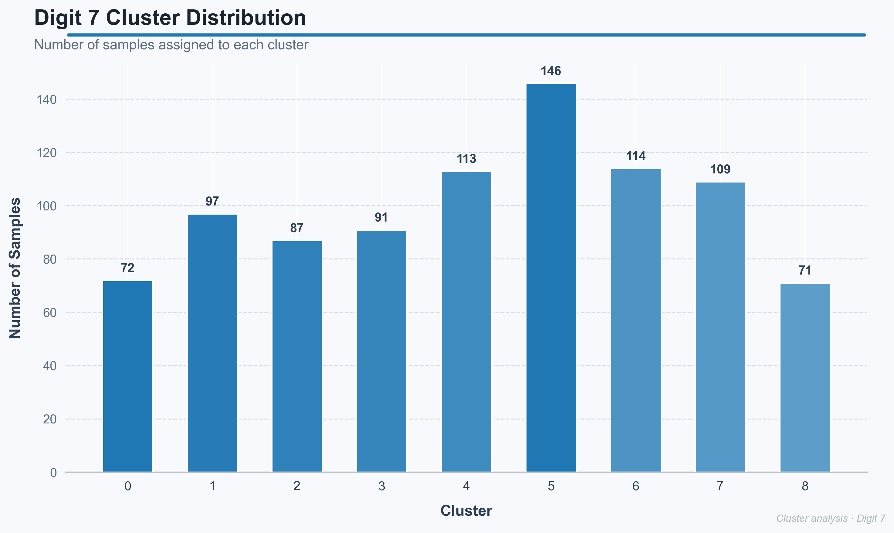
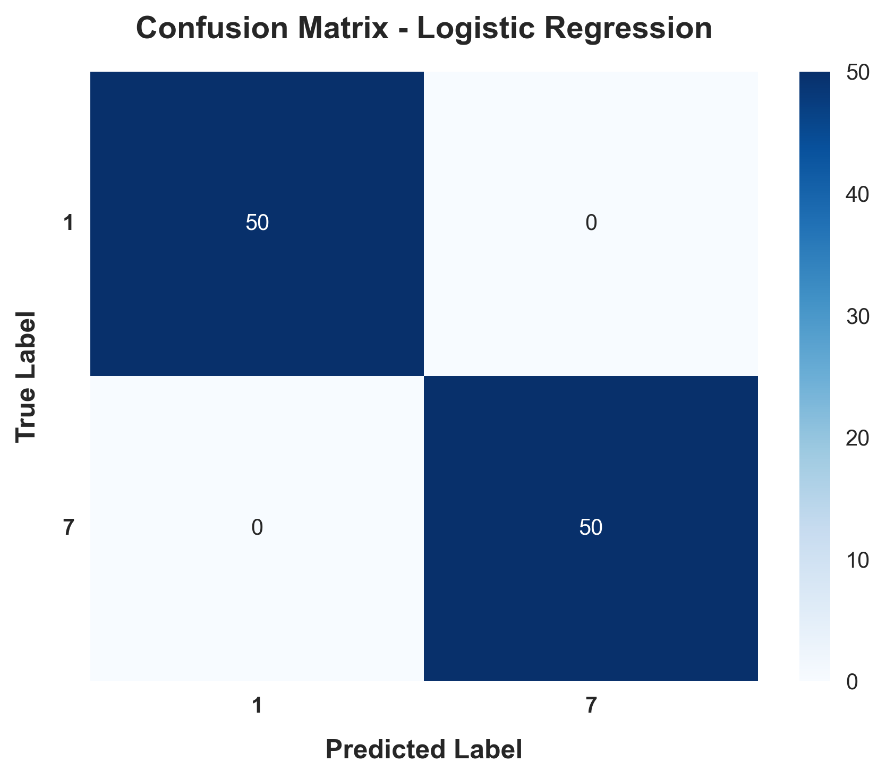
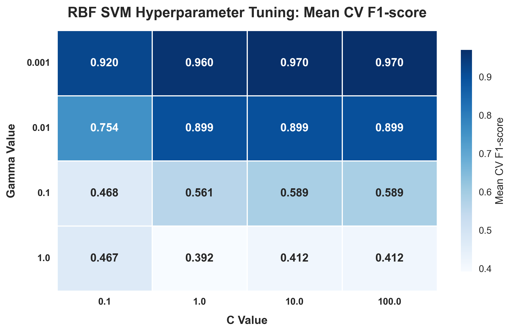
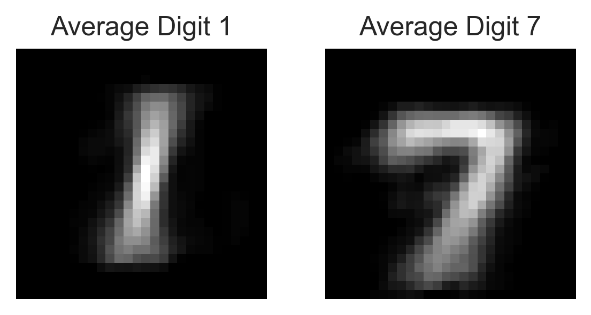

# ✍️ Handwritten Digit Classification and Clustering using Machine Learning

### Comparative Analysis of Logistic Regression, RBF Kernel SVM, PCA, and K-Means Clustering on MNIST Digits

> A machine learning project that combines supervised classification and unsupervised clustering to investigate handwritten digit recognition. The project compares Logistic Regression and RBF Kernel Support Vector Machine (SVM) for binary classification while applying Principal Component Analysis (PCA) and K-Means clustering to explore handwriting style variations of digit **7**.

<p align="center">
  
</p>

---

## Project Overview

Handwritten digit recognition is one of the classical problems in computer vision and machine learning. While classification models aim to identify digits accurately, unsupervised learning techniques can reveal structural similarities and writing-style variations that are not captured by classification alone.

This project combines both approaches using the **MNIST handwritten digit dataset**.

The study investigates:

- Binary classification of handwritten digits **1** and **7**
- Dimensionality reduction using Principal Component Analysis (PCA)
- Handwriting style discovery using K-Means clustering
- Hyperparameter optimisation of an RBF Kernel Support Vector Machine
- Comparative evaluation of supervised learning algorithms

---

## Project Objectives

- Build accurate classifiers for handwritten digit recognition.
- Compare the performance of Logistic Regression and RBF Kernel SVM.
- Reduce image dimensionality using PCA for visual interpretation.
- Identify natural handwriting style groups using K-Means clustering.
- Evaluate clustering quality using the Elbow Method and Silhouette Analysis.

---

## Dataset

The project uses the **MNIST Handwritten Digit Dataset**, one of the most widely used benchmark datasets in machine learning.

For this study:

- Only digits **1** and **7** were used for supervised classification.
- Images of digit **7** were extracted separately for clustering analysis.

---

# Methodology

## 1. Data Preparation

The images were preprocessed prior to modelling.

The workflow included:

- Image extraction
- Feature preparation
- Binary class selection (Digits 1 and 7)
- Train/Test split
- Feature normalisation

---

## 2. Principal Component Analysis (PCA)

Principal Component Analysis was applied to project the high-dimensional image features into two principal components for visual interpretation.

<p align="center">

</p>

The projection demonstrates clear separation between digits **1** and **7**, indicating that the selected classes are highly distinguishable within the feature space.

---

# Unsupervised Learning

## K-Means Clustering

To investigate handwriting diversity, K-Means clustering was applied exclusively to handwritten digit **7**.

The clustering workflow consisted of:

- Elbow Method
- Silhouette Analysis
- Cluster Centre Visualisation
- Representative Sample Selection
- Cluster Distribution Analysis

---

## Selecting the Optimal Number of Clusters

### Elbow Method

<p align="center">

</p>

The Elbow Method evaluates clustering compactness by measuring the within-cluster sum of squares (inertia) across different values of **k**.

---

### Silhouette Analysis

<p align="center">

</p>

Silhouette scores were used to evaluate cluster cohesion and separation. Based on both validation methods, **k = 9** was selected for the final clustering model.

---

## Cluster Centres

<p align="center">

</p>

Each cluster centre represents the average handwriting pattern of its assigned cluster, highlighting differences in stroke orientation, curvature, and writing style.

---

## Representative Samples

<p align="center">

</p>

Representative images illustrate real handwritten examples belonging to each cluster, demonstrating the diversity captured by the clustering algorithm.

---

## Cluster Distribution

<p align="center">

</p>

The sample distribution across the nine clusters shows that multiple handwriting styles naturally occur within the dataset while remaining reasonably balanced.

---

# Supervised Learning

Two supervised learning algorithms were implemented and compared.

| Model | Accuracy |
|--------|----------|
| Logistic Regression | **100%** |
| RBF Kernel SVM | **100%** |

---

## Logistic Regression

<p align="center">

</p>

Logistic Regression correctly classified every evaluation sample, demonstrating that digits **1** and **7** are highly separable using the extracted image features.

---

## RBF Kernel Support Vector Machine

### Hyperparameter Optimisation

<p align="center">

</p>

A Grid Search with Cross-Validation was performed to determine the optimal combination of **C** and **Gamma** values. Model selection was based on the highest cross-validation F1-score.

---

### Final Confusion Matrix

<p align="center">

</p>

The tuned RBF Kernel SVM also achieved perfect classification performance on the evaluation dataset.

---

# Results

| Analysis | Result |
|-----------|--------|
| Dataset | MNIST |
| Classification Classes | Digits 1 & 7 |
| Dimensionality Reduction | PCA |
| Clustering Algorithm | K-Means |
| Optimal Number of Clusters | **9** |
| Logistic Regression Accuracy | **100%** |
| RBF Kernel SVM Accuracy | **100%** |
| Hyperparameter Optimisation | Grid Search + Cross Validation |

---

# Key Visualisations

### Average Digit Images

<p align="center">

</p>

The average digit images illustrate the typical visual characteristics learned from each class. Digit **1** exhibits a highly consistent vertical structure, whereas digit **7** demonstrates greater variability in stroke angle and horizontal bar formation.

---

# Repository Structure

```text
handwritten-digit-classification/
│
├── data/
├── figures/
├── notebooks/
│   └── handwritten-digit-classification.ipynb
├── reports/
├── results/
├── README.md
└── requirements.txt
```

---

# Technologies Used

- Python
- NumPy
- Pandas
- Scikit-learn
- Matplotlib
- PCA
- K-Means Clustering
- Logistic Regression
- Support Vector Machine (RBF Kernel)

---

# How to Run

Clone the repository:

```bash
git clone https://github.com/yourusername/handwritten-digit-classification.git
```

Install the required packages:

```bash
pip install -r requirements.txt
```

Launch Jupyter Notebook:

```bash
jupyter notebook
```

Run:

```
notebooks/handwritten-digit-classification.ipynb
```

---

# Limitations

- The classification task is restricted to digits **1** and **7** rather than the full ten-class MNIST dataset.
- The clustering analysis focuses exclusively on digit **7** to investigate handwriting variability.
- The reported classification accuracy should therefore be interpreted within the scope of this binary classification problem.

---

# Future Improvements

Potential extensions of this project include:

- Multi-class handwritten digit classification.
- Deep learning models using Convolutional Neural Networks (CNNs).
- Non-linear dimensionality reduction techniques such as t-SNE and UMAP.
- Comparison with ensemble learning methods.
- Automated handwriting style detection using deep clustering techniques.

---

# Acknowledgements

This repository presents a professionally organised version of an academic machine learning project. The underlying methodology, implementation, and experimental results remain unchanged, while the repository structure, documentation, and visual presentation have been redesigned to showcase the project as part of a professional machine learning portfolio.